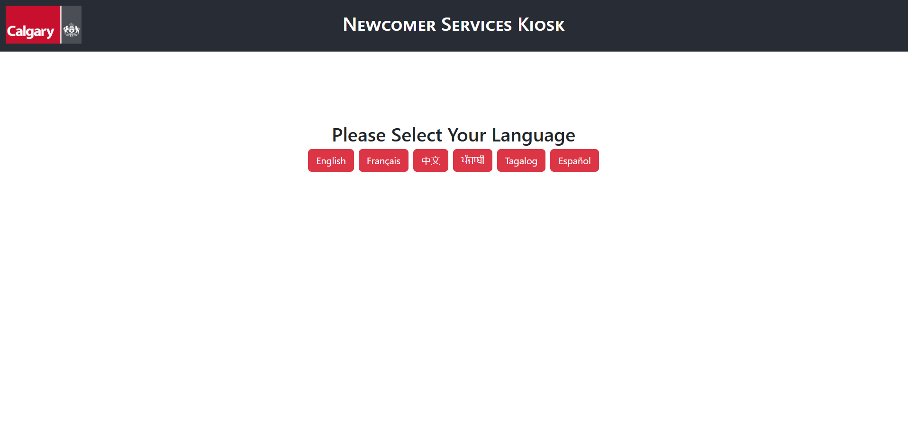

# Newcomer Services Kiosk

## To Run

In the project directory (481-app), you can run:

### `npm start`

Runs the app in the development mode.  
Open [http://localhost:3000](http://localhost:3000) to view it in your browser.

You should see the Select Language page.  

Press "English" to continue to the rest of the application. 
For the scope of this project (with TA's approval), the site will be displayed in English for all language selections.  
In the real-world scenario and with more technical knowledge, the site will be displayed in multiple languages.
